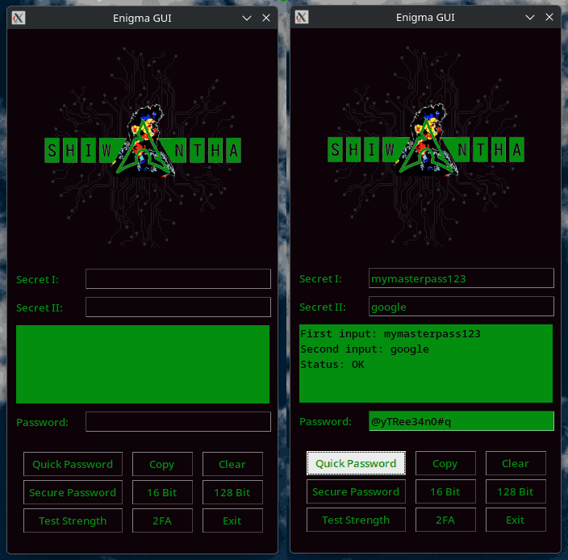

# ENIGMA - Password Toolkit

A **secure, deterministic password generator** that derives strong, unique passwords from a **single master password** and **site-specific parameters**.\
It uses **Argon2id with memory hardening** to resist brute-force and GPU/ASIC attacks, **stores no passwords**, and can **regenerate the same password on demand** given the same inputs.

This Kit also includes:

*  A **password strength analysis module**
*  A **device-specific password generator** for use as a second factor using **Device Context**

---

## ✨ Key Features ✨

* **Deterministic password generation**
* **No password storage**
* **Argon2id with strong memory hardening**
* **Unique passwords per site or service**
* **Password strength evaluation**
* **Device-specific derived passwords for 2FA**
* **Completely Offline**

---

## How It Works

Instead of storing passwords, this tool **derives** them.\
Given the same inputs, it will always generate the same password.

### Core Inputs

1. **Master Password**
   * Known only to the user
   * Never stored or transmitted

2. **Site-Specific Salt**
   * Typically taken from:
        + Domain name
        + Application identifier
        + Username or account label

3. **Optional Parameters**
   * Manually insert your password for strength checking tool.
   * Device context extracted for 2FA tool.

---

## Cryptography

### Password Derivation

The generator uses **Argon2id**, the current industry recommended password hashing algorithm.

**Why Argon2id?**

* Resistant to GPU and ASIC attacks.
* Memory-hard and time-hard.
* Combines protection against both side-channel and brute-force attacks.

### Argon2 Parameters

--> **Quick Generation**
```
time_cost=4,            # Iteration count
memory_cost=524288,     # 512 MiB (in KiB)
parallelism=2,          # Parallel threads
hash_len=64,            # 512-bit output
salt_len=16,            # 128-bit salt
type=argon2.low_level.Type.ID
```

--> **Extra Secure Generation**
```
time_cost=8,            # Iteration count
memory_cost=2097152,    # 2 GiB (in KiB)
parallelism=4,          # Parallel threads
hash_len=64,            # 512-bit output
salt_len=16,            # 128-bit salt
type=argon2.low_level.Type.ID
```

> These parameters are intentionally expensive to make brute-force attacks impractical.

---

## Feasibility Analysis

* **time_cost**: Number of iterations --> exmple : each hash computation will run 8 times.
* **memory_cost**: 2 GiB RAM per hash --> this makes GPU and ASIC cracking expensive.
* **parallelism**: 4 threads --> Argon2id can use multiple cores efficiently.
* **hash_len**: Output size --> doesn’t affect security against brute force.
* **salt_len**: Salt prevents precomputed attacks --> example : rainbow tables.

Argon2id with **2 GiB memory** and **8 iterations** is **very slow**, even on modern hardware.
> !!! The **strength depends mostly on the source passwords**, not just Argon2 parameters.

For Argon2id, the dominant constraints are :
* Available VRAM
* Memory bandwidth
* Sequential memory access patterns

--> An RTX 4090 ( Best consumer GPU at the moment in 2025 ) has 24 GiB of VRAM.\
--> Maximum theoratical concurrent hashes ≈ 24 GiB / 2 GiB = 12

This is because:
* GPU cores sit idle waiting for memory
* Memory bandwidth is saturated immediately

In reality, this is further reduced by :
* Kernel overhead
* Memory fragmentation
* Internal buffers

### Calculating Worst-Case Time to Exhaust the Keyspace at **12 hashes per second**

| Password type              | Possibilities | Estimated time to crack |
| -------------------------- | ------------- | ----------------------- |
| 8 lowercase letters        | ≈ 2×10¹¹      | 552 years               |
| 12 mixed letters + numbers | ≈ 3×10²¹      | 577 thousand years      |

8 lowercase letters passowrd --> Time = 26^8 / 12 = 17,402,255,381 seconds ≈ 552 years\
12 mixed case + numbers password --> Time = 62^8 / 12 = 18,195,008,798,741 seconds ≈ 577,000 years

>!!! on average an attacker may find the password in half the time.

### ASICs and FPGAs

**ASICs ( Application-Specific Integrated Circuits )**

Key Characteristics
* Purpose-built at the silicon level
* Extremely fast and energy efficient for their target function
* Inflexible once manufactured
* Very high development and fabrication cost

Constraints:
* Argon2id was explicitly designed to make ASICs uneconomical
* An ASIC would need **2 GiB SRAM per core**
* SRAM is Huge, Expensive and Power‑hungry

**FPGAs ( Field-Programmable Gate Arrays )**

Key Characteristics
* Hardware-level execution
* Reprogrammable
* More flexible than ASIC
* Less efficient and slower than ASICs
* More efficient than CPUs or GPUs for certain tasks

Constratints:
* Limited on-chip memory
* External memory bandwidth
* Cost per parallel instance

| Hardware | Flexibility | Speed        | Cost      | Typical Use                 |
| -------- | ----------- | ------------ | --------- | --------------------------- |
| CPU      | Very high   | Low/moderate | Low       | General computing           |
| GPU      | High        | High         | Moderate  | Parallel workloads          |
| FPGA     | Medium      | High         | High      | Specialized acceleration    |
| ASIC     | Very low    | Extreme      | Very high | Fixed-function acceleration |

---

## Deterministic Regeneration

No passwords are saved. To regenerate a password, simply provide:

* The same **master password**
* The same **site salt**

Allowing:

* Password recovery without backups.
* Stateless usage across devices.
* Easy migration and portability.

---

## Password Strength Analyzer ( In Development )

The project includes a module to **analyze generated (or external) passwords**.

### Strength Metrics

* Entropy (bits)
* Character set diversity
* Pattern detection
* Estimated resistance to:
  * Online attacks
  * Offline dictionary attacks
  * GPU-accelerated brute force

> This helps verify that the generated passwords meet or exceed security requirements.

---

## Device-Specific Passwords (2FA) ( In Development )

In addition to general passwords, the generator can derive **device-specific passwords** using **Device Context (Hardware identifiers)**.

### Use Cases

* Second factor authentication.
* Password + device binding.
* Zero storage alternative to OTP apps.

### Security Properties

* Deterministic per device.
* Cannot be regenerated on a different device.

---

## Security Model

### Threats Mitigated

* Password reuse
* Database breaches
* Credential stuffing
* Offline brute-force attacks
* Lost password vaults

### Threats Not Mitigated

* Keyloggers
* Phishing
* Weak master passwords

> **Your master password must be strong.**\
> This tool amplifies strong secrets but cannot fix weak ones.

---

## 🚀 Getting Started 🚀

### Basic Usage

0. Download the provided zip file.
1. extract the content.
2. run the executable.
3. Choose a strong master password
4. Define a site identifier (example: domain name)
5. Generate the password by clicking either "Quick Password" or "Secure Password" buttons.
6. Copy the generated password by clicking "Copy" button.



### Project Setup for Development

1. Clone the project.
```
git clone https://github.com/Shiwantha-I-Rodrigo/enigma.git
```
2. Setup a python venv in the project directory.
```
python3 -m venv env
```
3. Select terminal source.
```
source env/bin/activate --> (linux)
```
4. Install the llibrary requirements.
```
pip install cryptography
pip install argon2-cffi
pip install tqdm
pip install pillow
pip install pyinstaller
pip install pillow
```
5. Run the app.
```
python enigma_gui.py
```

---

## Design Principles

* **Stateless**
* **Zero knowledge**
* **Deterministic**
* **Memory-hard**

---

## Disclaimer

This project is provided for educational and security research purposes only.

---

## License

Copyright 2026 Shiwantha-I-Rodrigo

Permission is hereby granted, free of charge, to any person obtaining a copy of this software and associated documentation files, to deal in the Software without restriction, including without limitation the rights to use, copy, modify, merge, publish, distribute, sublicense, and/or sell copies of the Software, and to permit persons to whom the Software is furnished to do so.

THE SOFTWARE IS PROVIDED “AS IS”, WITHOUT WARRANTY OF ANY KIND, EXPRESS OR IMPLIED, INCLUDING BUT NOT LIMITED TO THE WARRANTIES OF MERCHANTABILITY, FITNESS FOR A PARTICULAR PURPOSE AND NONINFRINGEMENT. IN NO EVENT SHALL THE AUTHORS OR COPYRIGHT HOLDERS BE LIABLE FOR ANY CLAIM, DAMAGES OR OTHER LIABILITY, WHETHER IN AN ACTION OF CONTRACT, TORT OR OTHERWISE, ARISING FROM, OUT OF OR IN CONNECTION WITH THE SOFTWARE OR THE USE OR OTHER DEALINGS IN THE SOFTWARE.

---